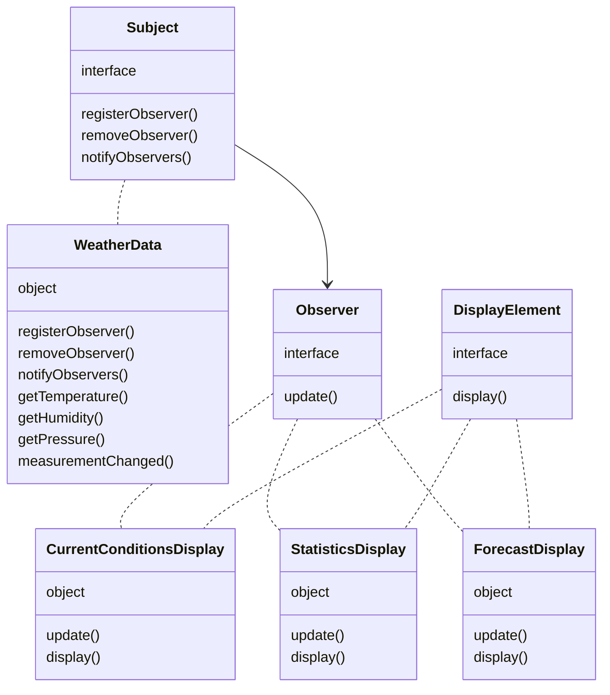

```mermaid
classDiagram

`Subject` .. `WeatherData`
`Subject` --> `Observer`

`Observer` .. `CurrentConditionsDisplay`
`DisplayElement` .. `CurrentConditionsDisplay`

`Observer` .. `StatisticsDisplay`
`DisplayElement` .. `StatisticsDisplay`

`Observer` .. `ForecastDisplay`
`DisplayElement` .. `ForecastDisplay`

class Subject {
    interface
}

Subject : registerObserver()
Subject : removeObserver()
Subject : notifyObservers()

class WeatherData {
    object
}
WeatherData : registerObserver()
WeatherData : removeObserver()
WeatherData : notifyObservers()
WeatherData : getTemperature()
WeatherData : getHumidity()
WeatherData : getPressure()
WeatherData : measurementChanged()

class Observer {
    interface
}
Observer : update()

class DisplayElement {
    interface
}
DisplayElement : display()

class CurrentConditionsDisplay {
    object
}
CurrentConditionsDisplay : update()
CurrentConditionsDisplay : display()

class StatisticsDisplay {
    object
}
StatisticsDisplay : update()
StatisticsDisplay : display()

class ForecastDisplay {
    object
}
ForecastDisplay : update()
ForecastDisplay : display()


```